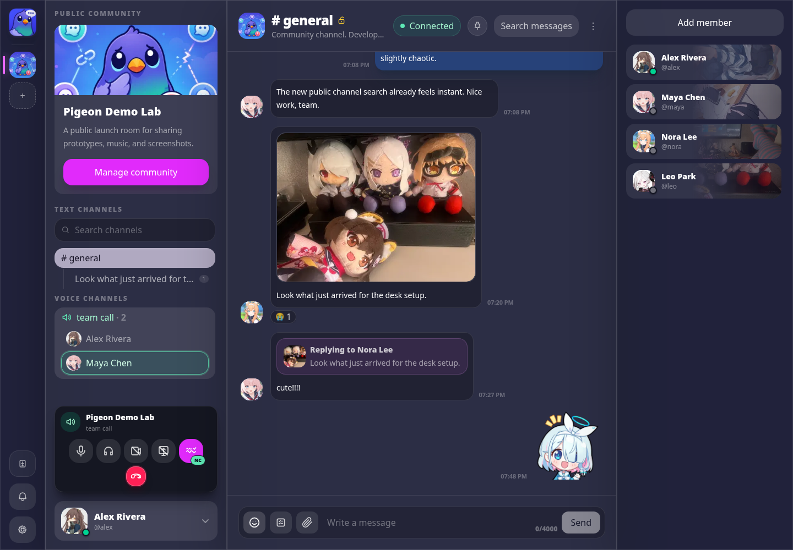

  

  
  
  
  

# Pigeon Swarm

Pigeon Swarm is a peer-to-peer communication platform built around self-hosted nodes, user-owned identities, and client-side encrypted conversations.

It is meant for communities that want channels, direct messages, profiles, attachments, realtime updates, and shared spaces without depending on one central platform account or one database that owns the whole graph.

The platform is designed to respect its users instead of quietly collecting everything they do. Your private keys never leave your device. Your password never leaves your device. Conversations are encrypted on the client side, so the network is used to deliver data, not to read it.

It supports both public and private networks. Public networks can be discovered and joined openly, while private networks require permission before outside nodes can connect. This allows communities to choose between an open federation model and a closed, invite-only network where unknown nodes cannot simply appear and participate.

Communities can also be public or private. A public community can be visible and accessible to users in the network, while a private community can restrict who can see it, join it, or participate in its conversations. Networks control node-level access. Communities control social and content-level access.

The platform uses peer-to-peer replication and IPFS-backed data distribution to make community data more resilient. Instead of relying on a single central server as the only source of truth, data can be copied across participating nodes so communities are not tied to one database, one machine, or one platform owner.

It takes inspiration from community chat tools such as Discord, but uses a peer-to-peer architecture instead of centralized servers.

This repository packages the full app into one Docker image. The backend and frontend still live in their own source repositories:

* [`haskou/pigeon-swarm-node`](https://github.com/haskou/pigeon-swarm-node)
* [`haskou/pigeon-swarm-ui`](https://github.com/haskou/pigeon-swarm-ui)

This repository provides:

* one published image for the complete app: [`ghcr.io/haskou/pigeon-swarm`](https://github.com/haskou/pigeon-swarm/pkgs/container/pigeon-swarm)
* a small [Docker Compose](docker-compose.yml) example for local startup with host folders
* simple default runtime configuration
* persistent IPFS and embedded local storage without an external database service
* optional private relay port exposure for private-network nodes
* automatic image publishing when `main` changes
* a dispatch path for the source repositories to request a fresh image

Docker image usage is documented in [docs/DOCKER_IMAGE.md](docs/DOCKER_IMAGE.md).

## License

This project is licensed under the PolyForm Noncommercial License 1.0.0. Commercial use requires a separate commercial license from the author.

See [LICENSE](LICENSE) and [NOTICE](NOTICE).

## Third-party assets

This project may include or reference third-party assets. See [ATTRIBUTIONS.md](./ATTRIBUTIONS.md).

## Disclaimer

Pigeon Swarm is not affiliated with, endorsed by, or sponsored by Discord Inc, NEXON, NEXON Games, Yostar, or the Blue Archive team.
