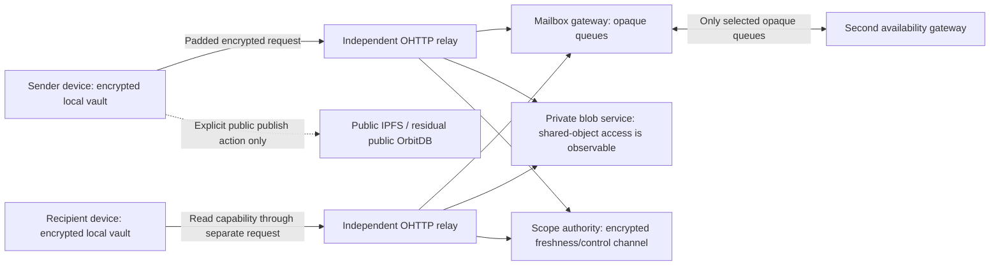

# ADR-001: Private data belongs to participants, not the network

Status: **Accepted architecture for implementation; not a claim of deployed protection.**
Date: 2026-09-06. Resolves the decision requested in [#30](https://github.com/haskou/pigeon-swarm/issues/30).

## Decision

Keep embedded storage. Do not add MongoDB to the default deployment. Replace
network-wide replication of private application documents with encrypted client
history and temporary, capability-authorized delivery queues. A private network
key remains a transport admission mechanism; it is not the authorization or
confidentiality boundary for a conversation.

Use IndexedDB for encrypted browser history and contacts, with an encrypted
export for recovery. Retain Level for backend queue storage, atomic outboxes and
non-sensitive node configuration. The backend must not receive a client vault
key. A remotely hosted backend is not automatically a trusted personal device.

Private messages, relationships, membership, call history, presence and private
attachment manifests must never enter global OrbitDB stores, public IPFS, DHT
records or shared network pubsub. Existing OrbitDB adapters remain only for
explicitly public publications during transition. There is no private-data
fallback to legacy replication when the new protocol is unavailable.

The [inventory](DATA-INVENTORY.md) records the current exposure. The
[storage evidence](STORAGE-DECISION.md) explains why an engine migration is not
required. The [contracts](CONTRACTS.md) define the boundaries to implement.

## Threat model and observable information

A participant can retain anything their device receives. Deleting our managed
copy cannot retract their copy, an old IPFS block, an operator snapshot or a
screenshot. Transport encryption does not remove source IPs, packet sizes,
connection times or a relay's ability to correlate its own traffic.

| Actor | Information the target design permits | Information it must not receive |
| --- | --- | --- |
| External observer | Addresses of communicating infrastructure, encrypted sizes and timing | Application identity, participant list, content, private CIDs or conversation IDs |
| Public IPFS relay | Public publications and public discovery traffic | Private delivery envelopes, private indexes or private history |
| Community node outside a private conversation | Deliberately public community state and its assigned service duties | Private membership lists, messages or calls merely because it joined the network |
| Mailbox gateway/operator | Random mailbox and delivery IDs, ciphertext, coarse expiry, queue size and request timing; linkage within one mailbox epoch | Identity IDs, conversation/group IDs, author signatures, attachment names, membership lists and client IP when the independent relay path is used |
| Oblivious HTTP relay | Client IP, gateway destination, encrypted request size/timing | Mailbox identifiers, capabilities, payload and application identity |
| Malicious or colluding operators | Their observations and retained copies; colluding relay and gateway may correlate endpoints | No stronger guarantee is claimed against collusion or a global timing observer |
| Blob operator | Opaque object IDs, sizes, expiry and repeated access to the same attachment; this reveals shared-object interest, but not client IP through the independent relay | Filenames, plaintext, conversation IDs and participant identities |
| Authorization authority | The roster/policy of its own authorized scope, signed revision and freshness requests | Unrelated private scopes; an ordinary mailbox operator is not this authority |
| Removed member | Previously received content and historical membership | New epoch keys, new delivery capabilities or permission to apply new operations |
| Compromised device | Its unlocked history, keys and conversations until revoked | Other conversations to which it was never admitted; retrospective erasure is not promised |

A random mailbox is scoped to **one relationship, direction, sending device and destination
device**, and rotates every 24 hours and on revocation. It is never an identity
hash, conversation hash, CID or reusable account-wide identifier. This permits
short-lived queue linkage; it does not make traffic unlinkable. A fresh random
128-bit delivery ID identifies retries of one recipient copy only. Different
recipients receive different IDs and independently wrapped ciphertext.

Use Oblivious HTTP through independently operated relay and mailbox gateway
roles for the private delivery path. The relay must strip forwarding headers,
cookies and client authentication identifiers; the gateway must not require an
account session. Running both roles under one operator does not satisfy the
operator-separation assumption. A direct path may be an explicit user-selected
availability mode, but cannot silently replace the private path. OHTTP separates
request knowledge from client addressing; it does not solve collusion or timing
correlation ([RFC 9458](https://www.rfc-editor.org/rfc/rfc9458.html)).

## Flow



```mermaid
sequenceDiagram
    participant A as Sender device
    participant M as Selected mailbox pair
    participant B as Recipient device
    A->>A: Verify membership head; sign and encrypt operation
    A->>M: Opaque recipient copy via OHTTP
    M->>M: Durable row + replication outbox
    M-->>A: Stored locally / replicated (distinct states)
    B->>M: Read capability + opaque cursor via OHTTP
    M-->>B: Unexpired envelopes only
    B->>B: Decrypt, verify authorship/authorization, deduplicate, persist
    B->>M: Acknowledge after durable local persistence
    M->>M: Delete body, propagate acknowledgement, retain bounded tombstone
```

### Client history, authentication and keys

Store the whole local record, including participant IDs, timestamps, attachment
names and search indexes, under a randomly generated vault key. Encrypt before
IndexedDB persistence. Unlocking, password derivation, key wrapping, device-bound
storage and backup formats belong to UI #172/#175 and the crypto package. Browser
storage eviction and XSS remain risks; a persistent browser database is not a
backup or a defense against malicious application code running while unlocked.

Select MLS 1.0 for participant/device key agreement in both direct and group
conversations, using standardized ciphersuite 0x0001. Each admitted device is a
separate member. Use a maintained interoperable implementation rather than a new
ratchet. MLS provides epoch-based key evolution; it still exposes framing such
as group ID outside its encrypted content. Wrap the complete MLS message in a
fresh recipient-specific HPKE envelope before delivery, including commits and
welcome messages. See [RFC 9420](https://www.rfc-editor.org/rfc/rfc9420.html#section-16.4)
and [RFC 9180](https://www.rfc-editor.org/rfc/rfc9180.html).

The outer recipient key is a conversation-scoped device key. While online, the
recipient provisions an authenticated rolling schedule of eight daily mailbox
and HPKE descriptors (current UTC day plus seven), with independent random IDs,
keys and capabilities. Peers receive the schedule only inside the protected
scope. Each descriptor has a write-validity interval; servers reject writes
outside it, so a sender cannot indefinitely extend an old queue's life. A
sender can deliver while the recipient is offline within that schedule. When
it is exhausted, sending stays local/pending until an authorized refresh.

A membership change invalidates pre-provisioned descriptors for removed
relationships. The scope policy delegates lease-retirement rights to its
revocation authority through the signed, recipient-encrypted grant and durable
receipt defined in [CONTRACTS.md](CONTRACTS.md). The pinned authority holds
retire-only capabilities before descriptors are advertised; it sees the scoped
sender/destination-to-lease mapping and can deny service, but receives no history decryption
keys. It revokes every unused future write lease in that
relationship before issuing replacement descriptors to remaining members.
Server revocation cannot erase old ciphertext, and MLS still independently
rejects unauthorized operations. New-mode activation requires testing this
schedule/revocation interaction, including an offline destination device.

Retain each old outer private key until the descriptor's **write-validity end
plus the maximum accepted retention**, not seven days after key creation. This
covers a last-minute write expiring on the eighth day. Then erase it. A compromised outer key can
reveal old framing within that window; it does not by itself replace MLS content
keys. Client export/recovery may deliberately retain history encryption keys,
so forward secrecy claims must distinguish transport keys from saved history.
The initial suite does not claim post-quantum security.

Device signing credentials and their binding to the user's verified identity
travel inside the protected conversation scope. Verify the binding through an
existing trusted device or an out-of-band fingerprint/QR exchange. Public key
lookup alone cannot rule out an equivocating directory. Unknown or changed
credentials require explicit verification; no automatic trust reset.

The [crypto implementation task](https://github.com/haskou/pigeon-swarm-crypto/issues/5)
owns the standard-protocol adapter, key lifecycle, canonical
operation encoding and interoperability vectors. This ADR selects the protocol,
not an unreviewed library: package selection, licensing compatibility, supported
browser/Node builds, independent review and cross-implementation vectors are
release gates. Until they pass, the new mode remains unavailable rather than
falling back to the shared network key.

### Groups, moderation, invitations and search

Private groups fan out client-side to admitted devices using their scoped
mailboxes. The mailbox service has no group-to-recipient directory. Each copy
has a different outer encryption and delivery ID. Version 1 caps a private
group at 128 devices; larger communities use explicitly public channels or wait
for a separately measured private group design. This is a delivery cost limit,
not a limit imposed by MLS.

Group members can see their own roster. Moderators receive only the private
groups they administer and reports deliberately disclosed by participants.
A public community directory may expose public names and roles, but must not
list private channel membership or private message references. Reports contain
selected evidence and a consented disclosure warning, not automatic history
uploads. Moderation records stay encrypted to the relevant administrator scope.

Invitations are random, expiring, single-use capabilities. Put the bootstrap
secret in a URL fragment or QR payload, never a server query string, access log
or replicated invite token document. Claiming an invitation does not itself
confer membership: an authorized membership commit admits the device. The
bootstrap contains the pinned identity/group verifier, supported protocol and
scoped delivery/key-package material. An expired, replayed or downgraded invite
fails closed. Reissuing an invite rotates its capabilities.

Search runs on the device over decrypted local history. Persist any index only
inside the encrypted vault. There is no server-side private full-text search,
private contact directory or globally enumerable private conversation catalog.
Public discovery remains separate and requires an explicit publication action.

### Partitions, membership and revocation

Creation uses the [explicit genesis contract](CONTRACTS.md): epoch/revision zero,
a null parent and one locally generated or independently pinned owner. The first
membership transition references that verified genesis head.

Each private scope has one signed, monotonically increasing authorization head
and a designated sequencer chosen in its membership policy. The sequencer orders
commits but cannot invent the required administrator signatures. Version 1 uses
one pinned owner as the default authority; policies admit at most 128 authority
keys with a threshold from one to the admitted key count. Reject unsatisfiable
policies before adoption. A configured administrator quorum is
recorded in the previous signed policy. Do not silently create concurrent
leaders during a partition. Authority recovery needs the previously authorized
quorum or the owner's offline recovery credential.

Sensitive operations (admission, removal, bans, role changes and device grants)
require the current signed head and exact parent revision. If the head cannot
be obtained or two incompatible heads appear, leave the operation pending and
surface the conflict. A timestamp is not authorization. Administrative changes
are serialized; ordinary message/reaction operations retain causal references
and idempotent operation IDs.

Before each outbound batch, obtain a challenge-bound head response from the
scope's authorized freshness authority through OHTTP and an authenticated
participant-scoped control channel. The response signs a fresh 256-bit client
nonce, scope, current revision/head hash and the batch commitment. Accept it
only within ten seconds of the local monotonic challenge start, once, and never
below a locally observed revision. Sensitive operations need their own response.
A cached signed head alone is insufficient against replay to a new device.

The owner may delegate this limited role to a trusted continuously available
device in the signed policy; it cannot grant itself administrative rights.
The freshness authority must not equivocate or attest stale heads. A malicious
authorized owner/authority can violate that trust assumption; signed checkpoints
make detected conflicts actionable but do not make that authority trustless.
If it is unreachable, composition works locally but transmission remains
pending. This is an explicit availability cost of the selected revocation policy,
not a reason to fall back to stale authorization. A membership removal commits a new MLS epoch and
rotates affected mailbox capabilities before new application messages are sent.
After observing removal, quarantine newly arriving old-epoch operations from
removed devices, even if they claim an earlier timestamp. This can delay a
legitimate offline message; do not silently discard it or apply it as a fresh
authorized write. Already verified local history stays readable.

Revocation cannot stop a partitioned or malicious participant reading old
ciphertext with old keys. Its enforceable guarantee is exclusion from future
accepted epochs once the authorization head is observed. Delivery acknowledgements
and transport retries cannot bypass this rule. Unknown versions, invalid proofs
and legacy operations have no permissive acceptance path in the new scope.

### Offline devices, recovery and attachment availability

Devices fetch pending envelopes within seven days. A client deduplicates using
the encrypted operation ID across servers and recipient copies, persists the
verified operation and ratchet state atomically, then acknowledges. A crash
before acknowledgement causes redelivery, not another visible message.

Mailbox capabilities rotate daily, while the device retains read/ack capability
for old queues until their last message expires. Reconnection reads those queues
before retiring them. A device offline beyond the retention/key window must
rejoin through an authorized device and request an encrypted history transfer;
the server cannot reconstruct its history. Lost devices are revoked. Recovery
requires another trusted device or a user-held encrypted export/recovery secret;
there is no operator reset that restores decryption access.

Private attachment bytes use an expiring authenticated blob service, not IPFS.
Both upload and download use the independent relay path; direct blob fallback
requires the same explicit reduced-privacy choice as direct mailbox access.
The blob operator sees repeated access to a shared encrypted object and can
infer common interest/fan-out. Version 1 accepts that residual linkage to avoid
128 complete file uploads for a 128-device group; it does not claim unlinkable
attachment retrieval. Object IDs and encryption are fresh per attachment and
scope, never reused across conversations or users. There is no plaintext
identity-to-object index. The operator's timing/size observations and collusion
remain part of privacy acceptance tests.
Encrypt chunks before upload; names, MIME types, keys, chunk hashes/order and
opaque download capabilities stay inside the encrypted manifest. Start with
1 MiB chunks and a 64 MiB attachment limit. Selected blob servers retain at most
two managed copies for seven days, independently of local recipient history.
Disable cross-user deduplication: equal plaintext must not yield a shared public
CID or stable object name. Public IPFS publication is a separate deliberate
operation. No private IPFS exception is approved by this ADR; a future exception
requires its own threat model, retention limits and user-visible disclosure.

Presence is opt-in per relationship, encrypted, and expires within 90 seconds;
there is no network-wide identity-to-node announcement. Call signalling uses the
same private participant boundary and a 60-second maximum queue lifetime; stale
signalling is rejected. Call history is local. Media still needs WebRTC/TURN
validation, and TURN endpoints can observe media-flow addresses and timing.

Private mode defaults to polling while the application is active. Push is
optional: use a generic wake-up with no conversation/message/call identifier,
and a separate opaque installation subscription with a 30-day expiry. The
provider still observes destination and timing. Background delivery latency
cannot be promised when the browser suspends execution or push is disabled.

## Retention and resource budgets

| Managed object | Limit and behavior |
| --- | --- |
| Message envelope | Seven days maximum; reject expired reads immediately, independent of sweeper timing |
| Call signal / presence | 60 / 90 seconds; never replay as current activity after expiry |
| Mailbox | Rotate every 24 hours; old queue becomes read/ack-only until expiry |
| Envelope bodies | Delete within 60 seconds of ack on healthy replicas; disconnected replicas enforce expiry locally before serving |
| Ack tombstones | Opaque IDs only, until original expiry plus 24 hours; reject resurrection during reconciliation |
| Queue backups | Disabled; availability comes from at most two selected live replicas, not indefinite snapshots |
| Local history | User-controlled retention; encrypted export is explicit; remote erasure is not implied |
| Logs | No capabilities, endpoints, private IDs, CIDs, payloads or key material; request-local random correlation only, 24-hour debug maximum; aggregate counters seven days |

A successful local durable write returns `stored-local`; only two durable copies
return `replicated`. Failure to reach the second server is visible and retried
through a bounded outbox. An acknowledgement has `pending-replica` and `complete`
states. Never claim every copy is deleted while a replica is unreachable. On
restart, enforce expiry before exposing reads and sweep expired rows. Compaction
and storage snapshots may retain old bytes; this is managed logical deletion,
not proof of physical erasure from SSDs or malicious backups.

Version 1 budgets are planning constraints, not production measurements:

- 4/16/64/256 KiB padded delivery buckets; reject larger requests and use blobs.
- 32 MiB or 8,192 envelopes per mailbox, whichever comes first; 256 MiB of
  temporary blobs per lease. Full queues reject writes without evicting unread
  messages. Issue anonymous resource leases; no account-wide sender ID.
- 60 requests/minute per mailbox lease across read/write/ack rights and bounded
  gateway concurrency, with
  independent ingress abuse controls. Capability creation itself needs admission
  limits; unlimited anonymous mailbox creation must not ship.
- Foreground delivery target p95 <= 2 seconds on a healthy 100 ms RTT path,
  including up to 250 ms batching. Active catch-up target <= 30 seconds applies
  to at most 50 queued envelopes totaling <= 1 MiB, with healthy authority and
  servers. Batch acknowledgements cover up to 50 deliveries. A full 8,192-row
  queue needs 164 read pages and 164 ack batches: target <= 10 minutes while at
  least 40 requests/minute are available for catch-up and no new writes arrive.
  These targets need end-to-end load tests before release.
- At 100 messages/day, 4 KiB each, two copies and seven-day retention: 5.47 MiB
  per recipient device before indexes/protocol overhead. A 128-device group can
  require 1 MiB of stored fan-out per message and about 700 MiB for that week's
  traffic. Budget bandwidth and quotas for fan-out, not only plaintext size.

Padding and batching reduce some size/timing precision. They do not promise
anonymity against a global observer. Long-lived media and optional push need
separate privacy choices.

## Transition and implementation order

1. Complete functional recovery and the community concurrency fix (#287).
   Freeze the inventory and these contracts; do not mutate existing history.
2. Implement authenticated operations and authorization-head verification
   (node #288), then the crypto adapter and client vault/device lifecycle.
   Distribute a verifiable client independently of the node operator (#31); a
   hostile page can steal an unlocked vault. Add protocol negotiation that
   cannot be downgraded by a peer.
3. Implement node #289 queues and selected replication behind a disabled mode,
   with crash/restart, expiry, replay, quota and operator-capture tests. Add the
   independent OHTTP path before describing the mode as metadata-private.
4. Implement client-owned history and scoped sync. Create **new** private scopes
   using the new format; do not dual-write their data into OrbitDB or IPFS.
5. Offer a local, read-only legacy import with provenance. Preview counts and
   export a backup first. Imported history is not a newly authorized remote
   operation. Joining devices require a fresh membership grant.
6. Migrate each consenting scope, rotate credentials and stop its legacy
   subscriptions/publications. Audit network capture and every storage/log path.
   Rollback preserves the local export and pauses new-mode sending; it never
   resumes plaintext metadata replication for a migrated scope.
7. Remove managed legacy data only through a separately reviewed, explicit
   migration action. Historical copies outside our control remain exposed.

## Ownership and completion gates

| Work | Repository / existing issue | Required result |
| --- | --- | --- |
| Operation authorization and partition policy | node #288 | Same proof/revision rules on local and remote paths; adversarial tests |
| Private queues, capabilities, expiry and replicas | node #289 | Durable states and strict outer contract; restart/loss/abuse tests |
| Vault, local unlock and recovery | UI #172, #173, #175; node #292; [crypto #5](https://github.com/haskou/pigeon-swarm-crypto/issues/5) | Encrypted metadata at rest, safe migration, protocol vectors and independently reviewed key lifecycle |
| Attachments | node #290; client attachment adapter | Private blobs and encrypted manifests; no public CID fallback |
| Presence, push and logging | node #291 | Remove identity-to-node broadcasts and event identifiers from wakeups/logs |
| Private groups and moderation | node #288; UI #174 | Scoped roster/policy and authorized commits; no global private catalog |
| Transport observation and final acceptance | wrapper #32/#34 | Captures from nonparticipants/relay/gateway, independent-operator path and realistic failure/load tests |
| Verifiable client distribution | wrapper #31 | Independently verified client artifacts; no trust in arbitrary node-served JavaScript |
| Legacy transition | wrapper #33 | Previewed local import, no dual-write, explicit cleanup and honest historical exposure |

This issue is complete when the decision, inventory, measured storage comparison,
contracts and transition are reviewed together. Dependent implementation issues
remain open. Neither the schema tests nor this document assert that users already
receive these protections.
